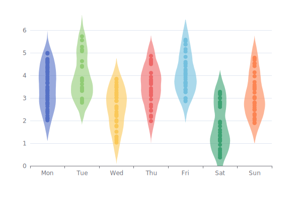
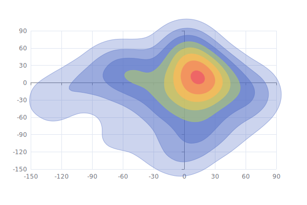
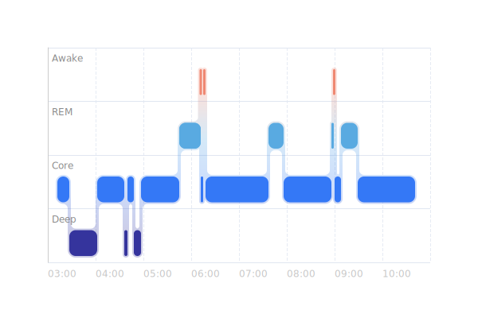
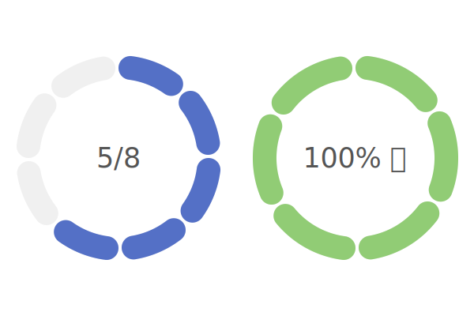
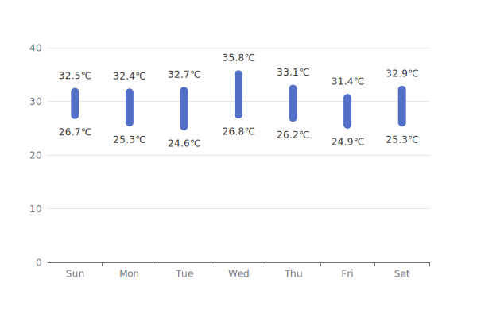

# echart-ggplot-style

📊 **High-quality, publication-ready charts using Apache ECharts, inspired by the aesthetics of ggplot2.**

This project provides a set of reusable ECharts chart templates and themes that mimic the clean, minimal, and publication-ready style popularized by R's ggplot2.

---

## 🔥 Why this project?

While ggplot2 is the gold standard in R for beautiful statistical plots, many web-based dashboards and publications require interactive JavaScript visualizations. Apache ECharts is powerful but its default theme is not publication-focused.

This repo bridges that gap by:
- Offering **custom ggplot-like themes for ECharts**
- Providing **reusable ECharts chart components** in `TypeScript` or `JavaScript`
- Creating **high-resolution, vector-exportable charts** suitable for scientific publication

---

## 🧰 Features

- 🎨 ggplot-style themes for ECharts
- 📈 Chart templates: line, bar, scatter, boxplot, violin, etc.
- 🧑‍💻 Written in TypeScript with React & ECharts-for-React
- 📄 Export options: SVG / PNG / PDF (via `html2canvas` or `svg-crowbar`)
- 📊 Beautiful typography, spacing, and grid control
- 🌐 Web-ready, suitable for blog posts, papers, and reports

---

> 🔬 **Note**: Currently works with ECharts **v6**, which is **not released yet**. You need to clone and build ECharts locally. See [Setup](#-setup) for instructions.

---

## 🧪 Available Custom Series

| Violin Plot | Contour Plot |
|-------------|--------------|
| [violin](custom-series/violin) <br>  | [contour](custom-series/contour) <br>  |

| Stage View | Segmented Doughnut |
|------------|--------------------|
| [stage](custom-series/stage) <br>  | [segmentedDoughnut](custom-series/segmentedDoughnut) <br>  |

| Bar Range | Line Range |
|-----------|------------|
| [barRange](custom-series/barRange) <br>  | [lineRange](custom-series/lineRange) <br>  |

> 🎯 Each chart includes support for ggplot-style themes, hover interactions, and is SVG-friendly for high-quality export.

---

## 🎨 ggplot-Inspired Styling

All charts follow these ggplot-style design principles:

- ✅ Minimalist grid and axis lines  
- ✅ Balanced white space and layout  
- ✅ Scientific typography  
- ✅ Publication-friendly color palettes  
- ✅ Exportable to **SVG** for high-resolution reports

>   
> _Example of scatter with ggplot-like styling_

---

## 🚀 Setup

### 1. Install dependencies

```bash
npm install
```

### 2. Build & link Apache ECharts v6 locally

Since ECharts v6 is still unreleased, you’ll need to build and link it manually:

```bash
# Under apache/zrender
git checkout v6
npm install
npm run prepare
npm link

# Under apache/echarts
git checkout v6
npm install
npm link zrender
npm link
npm run prepare
npm run build

# In echarts-custom-series
cd custom-series/<series-name>
npm link echarts
```

---

## 🛠 Development

### Create a new custom series

```bash
npm run generate <seriesName>
```

> Use **camelCase** for multi-word names:  
> ✅ `barRange` | ❌ `bar-range`

---

## 🧱 Build

### Build all custom series

```bash
npm run build
```

### Build one series

```bash
npm run build <series-name>
```

Example:

```bash
npm run build violin
```

---

## 🖼️ Generate Thumbnails

```bash
npm run thumbnail
# or only one
npm run thumbnail violin
```

These will appear in `/screenshots` and update the README preview.

---

## 📤 Publish to npm

_TODO: Coming soon._

---

## 🔭 Roadmap

- [x] Violin and density plots
- [x] Line/Bar with ranges (confidence intervals)
- [x] ggplot-style themes
- [ ] Boxplot, Beeswarm, Histogram
- [ ] Export helper: SVG / PNG / PDF
- [ ] Playground site with live editing

---

## 💬 Contributing

Pull requests are welcome! You can contribute new custom series, themes, or export helpers.

---

## 🪪 License

MIT © 2025 # echart-ggplot-style
# echart-ggplot-style
